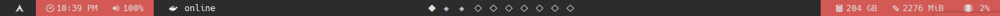

# HELLO THERE
## About
This is my first polybar theme, it was designed for my personal usage, containing some tools like a docker status, this docker status focus on try to watch if you have any container running and mark yourself as online.

I really expect that you like it. Therefore, if you wish to see an example of this theme being used, check below:

## Dependencies
- Font: Hack Regular Nerd Font.
- Package: pacman-contrib

## Installation
Put this folder in '~/.config/' and copy and paste the files on "fonts" in /usr/share/fonts/. After that, install the pacman-contrib package
